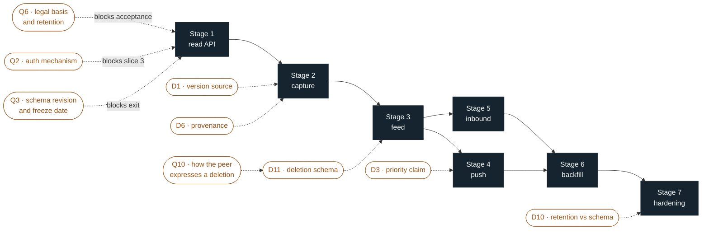
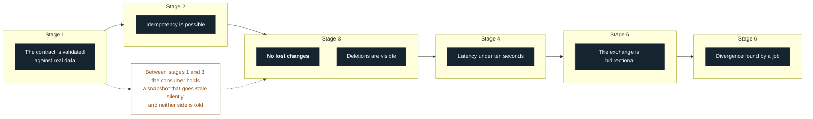
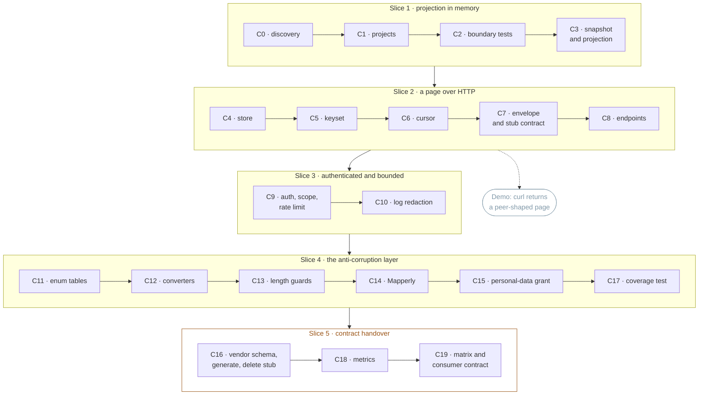
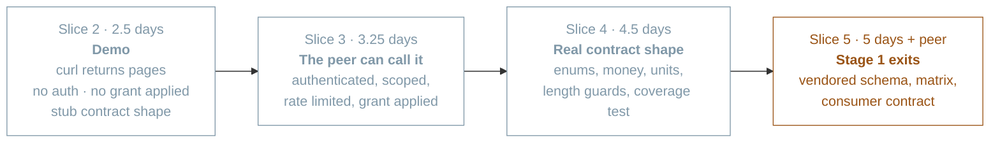
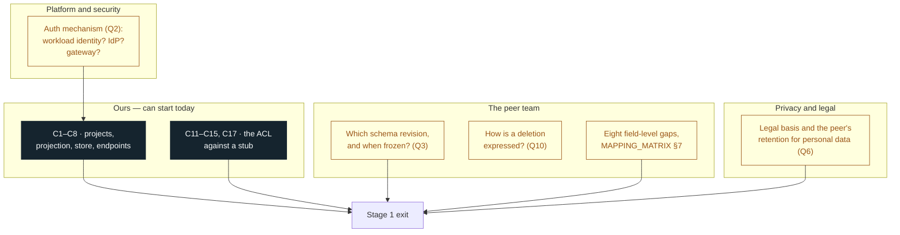

# Roadmap

- **Purpose:** the shape of the work in pictures — seven stages end to end, and stage 1 down to the
  commit.
- **Status:** **derived and presentational**, like [STAGES_DECK.md](STAGES_DECK.md).
  [ADR-0007](adr/ADR-0007-staged-delivery-and-the-first-increment.md) decides the staging;
  [BACKLOG.md](BACKLOG.md) owns sizing and sequencing; [STAGE_1_READ_API.md](STAGE_1_READ_API.md)
  owns the engineering detail. Where this file disagrees with any of them, they are right and this
  one is stale.
- **The deck versus this file:** the deck answers *what does each stage buy and what does it cost*.
  This answers *what happens in what order, and what is waiting on whom*.

All names are placeholders ([CLAUDE.md](CLAUDE.md#naming--all-names-are-placeholders)).

---

## 1. The whole programme

Durations are **engineering effort**, not calendar. The gap between the two is §5.

```mermaid
gantt
    title Seven stages, engineering effort
    dateFormat X
    axisFormat %s

    section Stage 1 — read API
    Discovery                      :s1a, 0, 1
    Projection and snapshot        :s1b, after s1a, 1
    Page over HTTP                 :milestone, m1, after s1b, 0
    Store, cursor, endpoints       :s1c, after s1b, 1
    Security floor                 :s1d, after s1c, 1
    The anti-corruption layer      :s1e, after s1d, 1
    Contract handover (blocked)    :crit, s1f, after s1e, 1

    section Stage 2 — capture
    Interceptor and version        :s2, after s1f, 4

    section Stage 3 — feed
    Materializer and outbox        :s3a, after s2, 4
    Cursor feed and watermark      :s3b, after s3a, 3

    section Stage 4 — push
    Subscriber, delivery, dispatch :s4, after s3b, 5

    section Stage 5 — inbound
    Ingress, inbox, translators    :s5, after s4, 5

    section Stage 6 — backfill
    Runs and reconciliation        :s6, after s5, 3

    section Stage 7 — hardening
    Retention, injection, game day :s7, after s6, 4
```



Units are days. Only stage 1 is estimated from a task breakdown; stages 2–7 carry the T-shirt sizes
from `BACKLOG.md` §2 rendered as days, and will move once their predecessor closes.

### What gates what



Stages 4 and 5 both depend on stage 3 and on nothing from each other, so they can run in either
order — or in parallel, if there are two people. Everything else is a chain.

Amber nodes are **entry conditions, not risks**. Stage 4 cannot start before `D3` is resolved,
because its central promise — that a multi-day backfill never delays a live change — is exactly what
`D3` breaks.

### When each promise lands



The design's first-priority property arrives **third**. That is the price of putting contract contact
first, and it belongs in `CONSUMER_CONTRACT.md` in those words.

---

## 2. Stage 1, slice by slice

Five slices, nineteen commits. Every commit compiles and leaves the tests green.



**Slices 1–4 are unblocked and can start today.** Slice 5 waits on the peer, and it is also the exit
criterion — which is why effort and calendar are two different numbers.

### Slice 1 in detail — what each commit produces

```mermaid
flowchart LR
    subgraph disc["C0 · Discovery — half a day, no code"]
        d1["Field inventory<br/>of Foo"]
        d2["EF mapping shapes:<br/>owned vs converter"]
        d3["Computed collection<br/>properties?"]
        d4["Read the generated<br/>keyset SQL"]
        d5["Column types:<br/>numeric, timestamptz, date"]
    end

    subgraph code["C1–C3 · One day"]
        p1["Three projects,<br/>reference direction"]
        p2["Boundary tests<br/>green while trivial"]
        p3["FooSnapshot"]
        p4["Projection as a<br/>static Expression"]
    end

    subgraph tests["Exit of slice 1"]
        t1["Fully populated Foo"]
        t2["Minimally populated Foo"]
        t3["No member left<br/>at its default"]
    end

    disc --> code --> tests

    trap["Compile() runs the real property bodies.<br/>A computed collection keeps its filter here<br/>and loses it in SQL — so slice 2 re-runs<br/>these same assertions through PostgreSQL"]
    tests -.-> trap

    classDef box fill:none,stroke:#8098A8,color:#8098A8
    classDef warn fill:none,stroke:#9A5416,color:#9A5416
    class d1,d2,d3,d4,d5,p1,p2,p3,p4,t1,t2,t3 box
    class trap warn
```



| Commit | Produces | Done when |
|---|---|---|
| **C0** | Written answers to guide §1, recorded as the `MAPPING_MATRIX.md` §2 field list | Every row has an answer, and **a human has read the generated keyset SQL** |
| **C1** | `Acme.Integration`, `Acme.Integration.Contracts`, test project; reference direction wired | `dotnet build`. **No NuGet package in the production project** |
| **C2** | The dependency-direction tests | Green — or they found a pre-existing violation, which is a finding, not a fix for this commit |
| **C3** | `FooSnapshot` and `FooSnapshotProjection.ToSnapshot` | Three in-memory tests pass. A `required` member left unassigned is already a compile error |

The projection is a static `Expression`, not a method body, because stage 3's materializer calls the
same definition. Hidden inside a method it gets copied, and the copies drift.

### Slice 2 — where the JSON appears

```mermaid
sequenceDiagram
    autonumber
    participant P as peer-a
    participant A as Api
    participant S as FooSnapshotStore
    participant D as PostgreSQL
    participant M as Stub mapper

    P->>A: GET /integration/v1/foos?cursor=&limit=
    A->>A: decode cursor (400 if malformed)
    A->>S: GetPageAsync(afterId, limit)
    S->>D: SELECT ... WHERE id > $1 ORDER BY id LIMIT $2
    Note over S,D: AsNoTracking, AsSplitQuery,<br/>Take(limit + 1) as the has-more probe
    D-->>S: rows
    S-->>A: IReadOnlyList&lt;FooSnapshot&gt;
    A->>M: ToContract(snapshot)
    M-->>A: ExternalFoo
    A-->>P: 200 { items, nextCursor, hasMore }
```

At the end of slice 2 the endpoint is **behind a flag, unauthenticated, and serving the stub contract
shape**. It is a demo for the team, not something to hand to the peer. That takes slice 3.

---

## 3. Three different meanings of "the JSON is available"

The phrase hides two days.



If "available over GET" means the peer can actually fetch data, the answer is **3.25 days, not 2.5** —
an unauthenticated endpoint is not shippable, and the personal-data grant has to be applied.

---

## 4. What is waiting on whom



**Three of the four boxes are not ours.** The eight gaps in `MAPPING_MATRIX.md` §7 currently have no
owner assigned, and a gap with no name against it does not move — assigning owners is the highest-value
half hour available right now.

---

## 5. Effort versus calendar

| | Stage 1 |
|---|---|
| Engineering effort | **5 days**, one engineer already familiar with the codebase |
| Unblocked today | Slices 1–4, about **4 days** |
| Waiting on others | Slice 5, plus Q2 before slice 3 and Q6 before acceptance |
| Calendar | **Set by the peer team's schema and by eight ownerless gaps**, not by the code |

Report the two numbers separately. Conflating them is finding **S7** in the
[design review](openspec/changes/add-cross-system-integration-layer/design.md), and it is the fastest
way to lose credibility when the date slips for reasons that were never about engineering.

Estimates assume discovery finds nothing from the cost list in
[STAGE_1_READ_API.md](STAGE_1_READ_API.md) §1.4 — a keyset comparison that does not translate, a value
object behind a single-column converter, or a computed collection property each add roughly half a
day, and a much larger aggregate scales C0 and C3 linearly.
