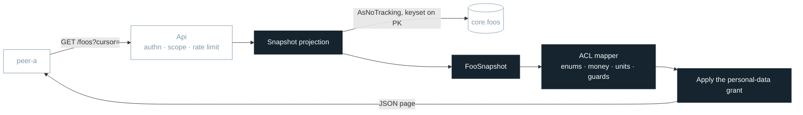
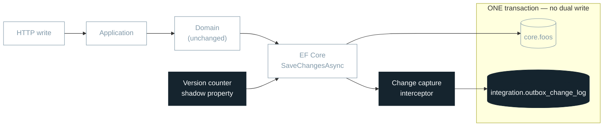
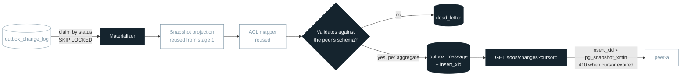
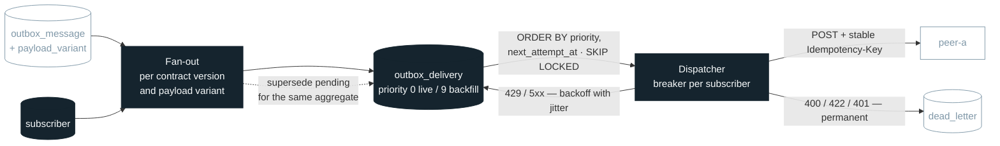
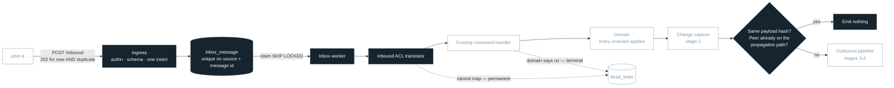
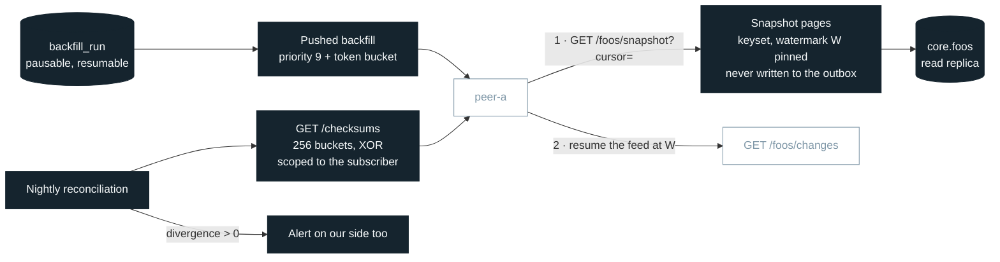
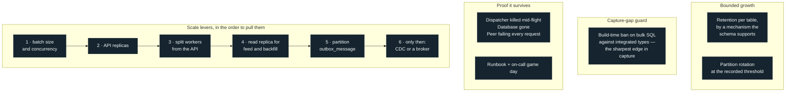
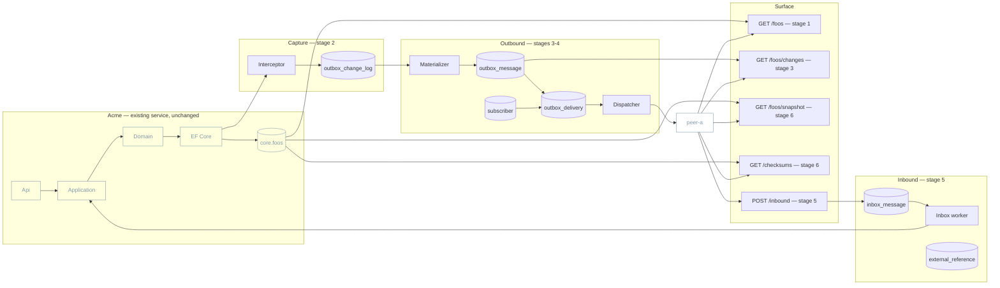

# Seven stages — walkthrough deck

- **Purpose:** a briefing view. What each delivery stage aims at, what a consumer can newly do,
  what the ordering costs, and how the architecture grows.
- **Status:** **derived and presentational.** Every statement here comes from
  [ADR-0007](adr/ADR-0007-staged-delivery-and-the-first-increment.md), which is authoritative. A deck
  is a view, not a source: if this document and an ADR disagree, the ADR is right and this file is
  stale. Update it in the same commit as the decision it renders.
- **Detail lives elsewhere:** [STAGE_1_READ_API.md](STAGE_1_READ_API.md) (how to build stage 1) ·
  [BACKLOG.md](BACKLOG.md) (epics, stories, sizing) · `openspec/changes/` (requirements as `SHALL`
  plus scenarios) · [design.md](openspec/changes/add-cross-system-integration-layer/design.md)
  (the defect register the gates refer to).

---

## Domain independence

**Nothing in this design depends on what the data means.** It is selected by four structural facts:
aggregates change inside database transactions, someone outside the service must observe those
changes, the peer owns the wire format, and no broker is available. Any domain matching those four
sentences fits unchanged.

`Acme` is the service, `Foo` the aggregate being published, `Bar` and `Baz` aggregates it
references, `peer-a` an external consumer — all placeholders
([CLAUDE.md](CLAUDE.md#naming--all-names-are-placeholders)).

**Diagram convention.** Filled nodes are added at that stage; outlined nodes already existed.
Cylinders are database tables. Each diagram shows the stage's new mechanism in context, with earlier
stages collapsed — the full picture is at the end.

---

## Stage 1 — Contract-shaped read API

**Goal.** Let a peer read the catalogue in *their* contract shape, page by page, built on demand from
current domain state.

| | |
|---|---|
| **New for a consumer** | Build a local copy by walking pages. Read one record for repair. Answer the eight open mapping gaps against **real payloads** rather than in the abstract. |
| **What it costs** | **No incremental sync** — replace-all only. **No deletion signal** — a removed record simply stops appearing. Read load on the primary, unbuffered. A working poller can become the integration nobody upgrades. |
| **Mechanism** | No new table, no migration, no worker, no change to the write path. Compile-time mapper whose unmapped-member diagnostics are build errors. Keyset pages over the primary key, so no index is needed. |
| **Release gate** | The consumer reconstructs the full catalogue; the mapping matrix is complete with zero unresolved gaps **against a named vendored revision** of the peer's schema; personal data appears only where an explicit grant permits it. |
| **Gates to clear first** | None — the stage is scoped to avoid all fourteen review defects. |
| **Waiting on others** | Which revision of the peer's schema and when it freezes (Q3); the auth mechanism (Q2). The consumer is confirmed: exactly one, one-to-one (Q17). |

---

## Stage 2 — Change capture, dark

**Goal.** Make it impossible to commit a business change without its integration record — while
still delivering nothing.

| | |
|---|---|
| **New for a consumer** | `aggregateVersion` appears in the stage 1 responses, additively. A consumer can start applying the version rule: ignore anything not newer than what it holds. |
| **What it costs** | **Still nothing is delivered** — this stage buys confidence, not function. Write amplification: one small insert per changed aggregate, on the user's critical path. A second consumer-visible contract iteration, even though the change is additive. |
| **Mechanism** | A `SaveChangesInterceptor` writes one narrow row per affected aggregate inside the same `SaveChangesAsync`. **No domain events, no base class, no marker interface** — the domain never learns integration exists. A registration map fails startup if an entity type is neither registered nor excluded. |
| **Release gate** | Rolling back the business transaction leaves **no** capture row; committing leaves exactly one; no measurable change in write latency. |
| **Gates to clear first** | `D1` version source · `D6` provenance columns |
| **Waiting on others** | Q9 — which version source. |

---

## Stage 3 — Incremental feed

**Goal.** Stop consumers re-reading the whole catalogue to find twelve changes — provably without
gaps.

| | |
|---|---|
| **New for a consumer** | Fetch only what changed since a cursor. **Receive tombstones**, so a withdrawn record is removed rather than kept forever. Get an explicit `410` when a cursor predates retention, instead of a silently incomplete page. |
| **What it costs** | **Feed lag equals the longest concurrent write transaction** — the price of a cursor that cannot skip a row. A 30-day catch-up window: offline longer means re-bootstrapping. Compaction skips intermediate states; the converged state is correct, the history is not complete. |
| **Mechanism** | Materialise off the request path, validate before the row is written, commit **per aggregate** so one bad record cannot stall its batch. The feed exposes only rows whose inserting transaction is guaranteed complete. |
| **Release gate** | The watermark test is a release gate: a slow transaction holding sequence *N* and a committed *N+1* must return **neither**, then **both**. |
| **Gates to clear first** | `D2` page versions · `D5` watermark scope · `D9` stage-1 retry · `D11` deletion schema · `D14` batch isolation |
| **Waiting on others** | The peer's deletion representation (Q10). PostgreSQL is confirmed at **17** (Q5), so risk R4 is closed. |

> **Why the watermark is the single most important line of SQL here.** `sequence` is assigned at
> insert time but rows become visible at commit time. A transaction taking sequence 100 and
> committing slowly, alongside one taking 101 and committing fast, lets a consumer advance past 100
> and never see it — silent, permanent loss that ordinary testing does not reproduce.

---

## Stage 4 — Push delivery

**Goal.** Deliver changes without requiring every consumer to build and operate a poller.

| | |
|---|---|
| **New for a consumer** | A push within seconds of the business write. Integrate without building a poller at all. Be onboarded as a row plus an identity-provider client — no deployment on our side. |
| **What it costs** | **At-least-once, never exactly-once.** Consumers must be idempotent; that is contractual, not advisory. Real operational surface arrives: dead letters, breakers, replay, alerts, a runbook to own. Personal data becomes a per-subscriber decision. |
| **Mechanism** | Claiming ordered by priority, so a multi-day backfill can never delay a live change. Compaction supersedes undelivered older messages for the same aggregate, which makes out-of-order delivery harmless by construction. Permanent failures are quarantined on the first attempt rather than retried into a poison loop. |
| **Release gate** | p95 delivery under 10 s; dead letters at zero; **500 000 backfill rows do not delay one live row**. |
| **Gates to clear first** | `D3` priority claim · `D4` compaction predicate · `S5` delivered-version index. `D7` and `D12` are **deferred at one consumer** — keep the payload-variant dimension and a per-aggregate last-hash row anyway |
| **Waiting on others** | Payload shape (Q1), subscriber entitlements (Q12). |

---

## Stage 5 — Inbound

**Goal.** Absorb peer data without giving external input a privileged write path.

| | |
|---|---|
| **New for a consumer** | Push data to us and get `202` for both a new message and a retry. Have a message rejected by our domain rules explicitly rather than half-applied. Keep your own identifiers correlated alongside ours, never substituted for our key. |
| **What it costs** | **Replication loops become possible** and must be actively suppressed. At two systems, suppressing the immediate sender is sufficient — the multi-hop cycle that defeats it needs a third participant, and there is none. Domain rejections need a policy. A correlation table to maintain, with conflicting bindings to adjudicate. |
| **Mechanism** | The ingress endpoint does authentication, structural validation and one deduplicated insert — nothing else. Domain mutation happens later, in a worker, through the **existing application command handlers**. A mapping bug on our side returns `202` and a retryable row, never a `500` the peer reads as delivery failure. |
| **Release gate** | Peer messages applied through the domain; echo suppression verified against the peer — a change absorbed from it does not bounce back. |
| **Gates to clear first** | `D6` loop suppression — direct source plus content hash; the multi-hop case is out of scope at two systems · `S1` identity resolution |
| **Waiting on others** | Push or poll (Q7), loop-prevention mechanism (Q11). |

---

## Stage 6 — Backfill and reconciliation

**Goal.** Get a new consumer from empty to synchronised with no freeze window, then prove daily that
it stayed that way.

| | |
|---|---|
| **New for a consumer** | Load the full catalogue and switch to the incremental feed with **no maintenance window**. Resume a crashed run from its own cursor. Compare 256 bucket hashes nightly instead of exporting the catalogue. |
| **What it costs** | Snapshot pages are computed on demand, so a large run loads the primary unless served from a replica. **Double delivery during the handover window** — harmless under the version rule, but it must be stated or someone files it as a bug. The canonical JSON form becomes a contract: changing it invalidates every stored hash. Reconciliation only pays off if the consumer implements the comparison. |
| **Mechanism** | Snapshot-then-stream: pin a safe watermark, serve keyset pages, resume the feed there. Records changed mid-run arrive twice and converge — **this is the second time the state-transfer decision pays for itself**, and why no freeze window is needed. Checksums are scoped to the authenticated subscriber, or a filtered consumer mismatches on every bucket every night. |
| **Release gate** | Checksums converge; divergence stays at zero for a week. |
| **Gates to clear first** | None. `D8` is deferred: with one subscriber, its scope is the whole catalogue |
| **Waiting on others** | Catalogue size (Q8), checksum scope (Q13). |

---

## Stage 7 — Hardening

**Goal.** Make the thing survivable by someone who did not build it.

| | |
|---|---|
| **New for a consumer** | Nothing. That is the point of this stage. |
| **What it costs** | Partition management is genuinely new operational work. **Nothing here is demonstrable to a stakeholder**, which is exactly why it gets cut — and why it is a stage with a gate rather than a backlog wish. |
| **Mechanism** | Retention by a mechanism each table's schema actually supports. Failure injection rather than assumption. Feed and backfill reads moved to a replica; workers split from the API by configuration, not by a rewrite. |
| **Release gate** | On-call trained; alerts verified in a game day, **not** in an incident. |
| **Gates to clear first** | `D10` retention versus schema |
| **Waiting on others** | — |

---

## The target state

Everything above, assembled. This is what stage 7 leaves behind.

**When Kafka eventually arrives, only the dispatcher's transport changes.** The outbox, the
contracts, the mapping and the inbox all survive — which is why the outbox is not wasted work even
though it reproduces a slice of a broker.

---

## When each promise actually arrives

The ordering is deliberate and it has a price: the guarantee this design values most does not come
first.

| Arrives | Promise | Why then, and not earlier |
|---|---|---|
| **Stage 1** | The contract is validated against real data | Payloads a second party can read and object to. The only item on this list another team can block, so it goes first. |
| **Stage 2** | Idempotency is possible | A monotonic version per aggregate, so a consumer can safely ignore a stale update. |
| **Stage 3** | **No lost changes** | The design's first-priority property. Needs durable capture *and* a cursor that provably cannot skip a row. |
| **Stage 3** | Deletions are visible | Tombstones in the feed. Before this, a removed record simply stops appearing. |
| **Stage 4** | Latency under ten seconds | Push with retry, breakers and dead letters, and live traffic a backfill cannot starve. |
| **Stage 5** | The exchange is bidirectional | Peer data enters through existing command handlers, so it passes every domain invariant. |
| **Stage 6** | Divergence is found by a job | Nightly bucket checksums, rather than by a business user noticing wrong data. |

**Between stages 1 and 3 a consumer holds a snapshot that goes stale silently, and neither side is
told.** That is the real cost of putting contract contact first, and it belongs in the
consumer-facing contract in those words.

---

## Inside stage 1 — five slices

Every slice compiles and leaves the tests green. The stub contract appears in slice 2 and is deleted
in slice 5, so the pipe is end to end before the peer's schema exists.

| Slice | Ends with | Contents |
|---|---|---|
| **1** | The projection asserted **in memory** | Projects, the dependency-direction test while it is trivially green, the flat snapshot, one canonical projection expression. No database, no mapper, no endpoint. |
| **2** | **A peer-shaped page over HTTP** — the demo | Store, keyset paging, cursor, a hand-written stub contract, both endpoints. The same assertions re-run through PostgreSQL: the pair that catches the EF translation traps. |
| **3** | Authenticated, bounded, reversible | The authenticator seam, one scope, per-caller rate limit, log redaction, personal data emitted under the recorded grant, and a flag that turns it all off. |
| **4** | The anti-corruption layer, proven total | Fail-closed enum tables, value converters, length guards that raise rather than truncate, and the reflection test that names any domain field you forgot. |
| **5** | Contract handover — ⛔ blocked externally | Vendor the peer's schema, generate the types, delete the stub, complete the mapping matrix, write the consumer contract. This is the exit criterion. |

Slices 1–4 are unblocked and can start today. Slice 5 waits on another team, which is why effort
(five engineering days) and calendar are reported as two numbers.

---

## All seven at a glance

| Stage | Goal | New for a consumer | What it costs | Gates |
|---|---|---|---|---|
| **1** Read API | A peer reads the catalogue in their contract shape | A local copy, built by walking pages | No incremental sync, no deletion signal | — |
| **2** Capture | No change can commit without its integration record | A version to compare against | Still nothing delivered | `D1` `D6` |
| **3** Feed | Incremental sync without gaps | Only what changed, plus tombstones | Feed lag equals the longest write transaction | `D2` `D5` `D9` `D11` `D14` |
| **4** Push | Seconds instead of a poll interval | A push, with no poller to operate | At-least-once; real operational surface | `D3` `D4` `S5` |
| **5** Inbound | Peer data enters through the domain's front door | Send us data and get `202` | Replication loops become possible | `D6` `S1` |
| **6** Backfill | Bootstrap with no downtime; divergence found nightly | Full load with no maintenance window | Double delivery during handover | — |
| **7** Hardening | Survivable by someone who did not build it | Nothing — that is the point | Nothing demonstrable, so it gets cut | `D10` |

A gate is a **hard entry condition**, not a risk note: stage 4 cannot start before `D3` is resolved,
because its central promise is the thing `D3` breaks.

---

## Component inventory

Twenty-six integration parts, and the stage each first appears in. Nothing in the "existing service"
column is ever modified.

| Existing service | Integration workers | `integration` schema | Surface and peers |
|---|---|---|---|
| `Api` | `Snapshot projection` — 1 | `outbox_change_log` — 2 | `GET /foos` — 1 |
| `Application` | `ACL mapper` — 1 | `outbox_message` — 3 | `Auth + scope + rate limit` — 1 |
| `Domain` | `Change capture interceptor` — 2 | `subscriber` — 4 | `peer-a` (pull) — 1 |
| `EF Core` | `Version counter` — 2 | `outbox_delivery` — 4 | `GET /foos/changes` — 3 |
| `core.foos` | `Materializer` — 3 | `projection state` — 4 | `peer-a` (push) — 4 |
| | `Dispatcher` — 4 | `inbox_message` — 5 | `POST /inbound` — 5 |
| | `Inbox worker` — 5 | `external_reference` — 5 | `GET /checksums` — 6 |
| | `Reconciliation job` — 6 | `backfill_run` — 6 | `Admin + runbook` — 7 |
| | `Retention + analyzer` — 7 | `partitions` — 7 | |
